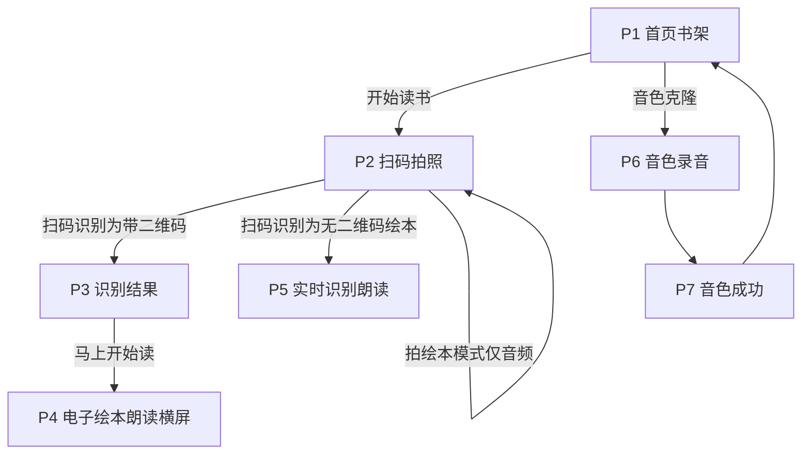
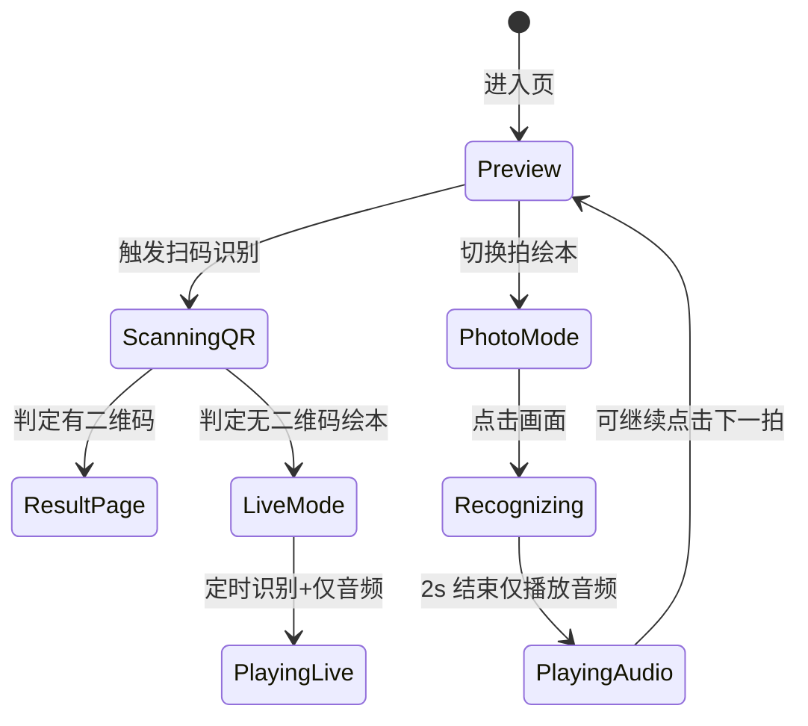

# Step 2 — 交互说明与视觉规格（知绘本 Demo）

> **关联文档**：[`PRD-知绘本-Demo.md`](./PRD-知绘本-Demo.md)  
> **版本**：1.0｜**日期**：2026-05-11  
> **交付物**：本文档 + [`/step2-flow/index.html`](../public/step2-flow/index.html)（浏览器内可点击流程原型）

---

## 1. Step 2 冻结结论（衔接 PRD §12）

| 项目 | Step 2 冻结结论 |
| ---- | ---------------- |
| **PostCSS 设计基准** | 宽度 **375px**（逻辑像素），竖屏为主；横屏 **P4** 以 **667×375**（iPhone 8 横屏比例）为布局基准，**Pad / 大屏允许整体等比缩放**（`transform: scale` 或根字号缩放二选一，实现阶段择优）。 |
| **适配插件（建议）** | `postcss-px-to-viewport`：`viewportWidth: 375`，`unitPrecision: 5`，`propList: ['*']`；需排除的文件（如第三方组件）用注释或 `selectorBlackList` 按需配置。 |
| **拖拽范围（Demo）** | ① **无** HTML5 Drag & Drop。② **麦克风**：长按录音使用 Touch/Mouse **按下/抬起**，控件加 `touch-action: none`。③ **可选**：P4 绘本区 **水平滑动手势** 翻页（`touchmove` 判定阈值翻页，非系统拖拽 API）。④ 书架卡片 **不做拖拽排序**（Step 3 除非 PRD 追加）。 |

---

## 2. 全局布局与一屏策略

### 2.1 安全区与高度分配（竖屏 @375）

| 区域 | 高度（px，设计稿） | 说明 |
| ---- | ------------------- | ---- |
| 状态栏占位 | 44 | 透明或与顶栏融合；可用 `env(safe-area-inset-top)` |
| 页面顶栏 / 装饰区 | 72–120 | 视页面：P1 含云朵星星动画 |
| **主内容区** | **flex:1** | 书架网格、相机预览等 |
| 底部 Tab（仅 P1） | 56 + safe-area | 固定底栏 |
| 底部操作（P2/P5/P6） | 80–120 | 手电筒、相册、录音按钮等 |

**原则**：主流程页 **不出现整页纵向滚动**；书架绘本列表若超过一屏，**仅主内容区内部滚动**（列表类例外，与 PRD §3.5 一致）。

### 2.2 Pad / 横屏

- **Pad 竖屏**：以 375 宽为基准整体缩放至可视宽度（略缩放），保持元素相对比例。
- **P4 横屏**：外框 **667×375**；若设备为竖屏物理 holding，展示 **旋转提示蒙层**（插画 + 文案），点击「我知道了」关闭蒙层但仍依赖用户旋转（与 PRD 一致）。

---

## 3. 设计令牌（Design Tokens）

### 3.1 色彩（衔接 PRD §11）

| Token | 值 | 用途 |
| ----- | ----- | ----- |
| `--color-primary` | `#FF9F3A` | 主按钮、强调 |
| `--color-bg` | `#FFF8E7` | 页面背景 |
| `--color-text` | `#2C3E50` | 正文 |
| `--color-text-muted` | `#6B7280` | 次要说明 |
| `--color-sky` | `#5EC8FF` | 装饰、辅色 |
| `--color-strawberry` | `#FF7BA3` | 装饰、辅色 |
| `--color-lemon` | `#FFE566` | 星星、高光 |
| `--color-mint` | `#7ED957` | 成功态 |
| `--color-card-shadow` | `rgba(44, 62, 80, 0.12)` | 卡片投影 |

### 3.2 字体

```text
font-family: "PingFang SC", "Microsoft YaHei", sans-serif;
```

- **标题**：600–700，页面主标题约 20–22px（375 稿）。
- **正文**：400，约 14–16px。
- **按钮**：600，约 16px。

### 3.3 圆角与「3D」卡通

| 元素 | 规格 |
| ---- | ----- |
| 大卡片 / 面板 | `border-radius: 24px` |
| 主按钮 | `border-radius: 9999px` 或 28px；底部「厚度」用 `box-shadow` 模拟（如 `0 6px 0 #E8892E`） |
| 按压反馈 | `transform: translateY(2px)` + 阴影减弱，时长约 120ms |

---

## 4. 信息架构与可点击流程

浏览器打开开发服务器后访问：**`/step2-flow/index.html`**（或构建后同源路径），可按按钮切换 **P1–P7** 及 **分支（二维码 / 无二维码）**。

### 4.1 总流程（Mermaid）



### 4.2 P2 状态机（简化）



---

## 5. 逐页线框（375 竖屏基准，单位 px）

以下为 **结构示意**；精确像素可在 Step 3 按组件微调。

### P1 首页（书架）

```text
┌──────────────────────────── 375 ────────────────────────────┐
│  ┌ 装饰层：云 / 星 / 气球（CSS 动画，不占交互）                   │
│  │                    我的绘本书架                               │
├───────────────────────────────────────────────────────────────┤
│  ┌─────────────────┐  ┌─────────────────┐                     │
│  │   绘本卡片 2列    │  │                 │   ← 行高约 200       │
│  └─────────────────┘  └─────────────────┘                     │
│  （空状态：居中插画 + 「扫一本绘本开始吧~」）                     │
├───────────────────────────────────────────────────────────────┤
│ [ 书架 ]    [ 开始读书 ]    [ 音色克隆 ]     ← Tab 高约 56       │
└───────────────────────────────────────────────────────────────┘
```

**交互**：点击卡片 → P4（已有书）；「开始读书」→ P2；「音色克隆」→ P6。

---

### P2 扫码 / 拍照

```text
┌───────────────────────────────────────────────────────────────┐
│  ✕ 关闭          [ 扫二维码 | 拍绘本 ]            ← 模式 Segmented │
├───────────────────────────────────────────────────────────────┤
│░░░░░░░░░░░░░░ 摄像头全屏预览 ░░░░░░░░░░░░░░░░░░░░░░░░░░░░░░░░░░│
│░░░░░░░░░░░░░░░░░░░░░░░░░░░░░░░░░░░░░░░░░░░░░░░░░░░░░░░░░░░░░░░│
│░░░░┌─────────────────────────┐░░░░░░░░░░░░░░░░░░░░░░░░░░░░░░░░░│
│░░░░│   虚线识别框 + 提示气泡   │░░░░░░░░░░░░░░░░░░░░░░░░░░░░░░░░│
│░░░░└─────────────────────────┘░░░░░░░░░░░░░░░░░░░░░░░░░░░░░░░░│
├───────────────────────────────────────────────────────────────┤
│        🔦 手电筒          🖼 相册                               │
└───────────────────────────────────────────────────────────────┘
```

**交互要点**：

- **扫码**：Demo 用「模拟：有二维码 / 无二维码」开关或按钮取代真实识别（Step 3 实现）。
- **拍绘本**：点击预览区 → 全屏 Loading → 2s 后 **仅播放音频**，画面回到预览；**无文字层**。
- **转 P5**：无二维码分支时，顶栏可变为 P5 样式（状态文案 + 关闭），预览区保持相机。

---

### P3 识别结果（仅二维码路径）

```text
┌───────────────────────────────────────────────────────────────┐
│  ✕                                                             │
│     ✨ 烟花层（轻量 CSS）                                        │
│           🎉 找到啦！                                           │
│        ┌───────────────┐                                       │
│        │  3D 书本插画   │                                       │
│        └───────────────┘                                       │
│         《小兔子的梦想》                                        │
│            作者：张三                                           │
│            ✓ 已加入书架                                         │
│                                                                │
│            ┌─────────────────┐                                │
│            │   马上开始读      │                                │
│            └─────────────────┘                                │
└───────────────────────────────────────────────────────────────┘
```

**说明**：已移除「稍后再读」；返回依赖左上角关闭 → 回 P1 或上一页（实现时约定）。

---

### P4 电子绘本朗读（横屏布局基准 667×375）

```text
┌──────────────────────────── 667（宽）─────────────────────────────┐
│ ← 返回    书名xxxxxxxx    ♪ BGM   ⋯                               │
├───────────────────────────────────────────────────────────────────┤
│                                                                    │
│              ┌─────────────────────────────────┐                  │
│              │      仅绘本插图（contain）        │   无文字层       │
│              └─────────────────────────────────┘                  │
│                                                                    │
├───────────────────────────────────────────────────────────────────┤
│  ◀   ⏯   ▷    音色 ▼      3 / 10                                   │
└───────────────────────────────────────────────────────────────────┘
```

---

### P5 实时识别朗读（由 P2 转入，无独立 Tab）

```text
┌───────────────────────────────────────────────────────────────┐
│  ✕ 关闭                    ● 识别中（非文案，可用脉冲光点）          │
├───────────────────────────────────────────────────────────────┤
│░░░░░░░░░░░░ 全屏相机 + 中心光圈/书本旋转装饰（无文字）░░░░░░░░░░░│
├───────────────────────────────────────────────────────────────┤
│  🔊 播放状态指示（波形或图标）    音色切换                         │
└───────────────────────────────────────────────────────────────┘
```

**禁止**：识别字幕、假段落文字；允许图标 + 播放进度条（可选）。

---

### P6 录音 / P7 成功（摘要）

- **P6**：朗读提示卡片 + **大麦克风**（`touch-action: none`）长按录音；波形条；`已录制 xs / 15s`；底部「重新录制」「完成」。
- **P7**：成功标题 + 试听 + 波形；角色 chips（妈妈/爸爸/…）；输入名称；「保存」「重新录制」。

---

## 6. 动效与反馈（实现优先级）

| 场景 | 建议实现 |
| ---- | --------- |
| Tab / 按钮按下 | `transform` + 阴影，≤150ms |
| 扫码成功 | 短震动 + 本地 beep；绿色边缘光闪一次 |
| 加载 | 书本图标 `rotate` + 轻微 `translateY` |
| P3 入场 | 书本 `scale` + `opacity`，避免大范围粒子 |
| 波形 | Canvas 或 CSS bar，帧率可控 |

---

## 7. PostCSS 与开发备注

- 设计稿标注：**375px 宽** 下导出切图（JPG/PNG）；图标可用 SVG。
- 构建：**禁止**外链脚本与第三方 H5；音视频资源走 `/public`。
- `viewport`（生产）：`width=device-width, initial-scale=1.0, maximum-scale=1.0, user-scalable=no`（当前仓库 `index.html` 需在 Step 3 对齐）。

---

## 8. Step 3 建议开发顺序

1. **路由壳 + P1**（书架与 Tab）  
2. **P2**（相机占位 + 模式切换 + Demo 分支）  
3. **P3 → P4**（二维码路径）  
4. **P5**（无二维码分支）  
5. **P6 → P7**  
6. 统一动效、权限引导、ES5 构建链路

每页开始前仍建议与您 **确认该页范围**（与 PRD Step 3 工作流一致）。
